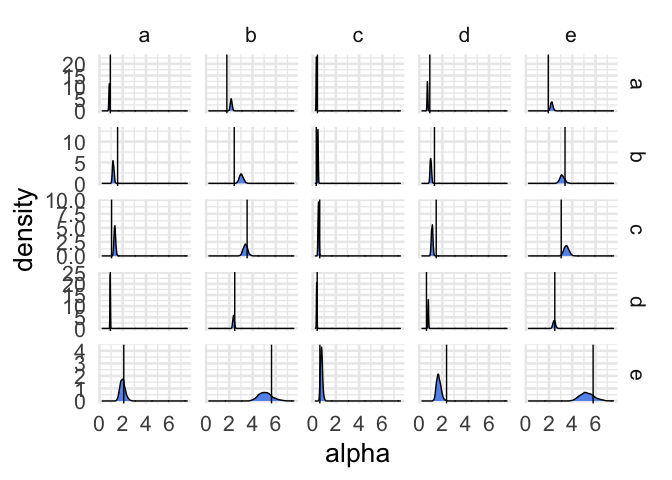
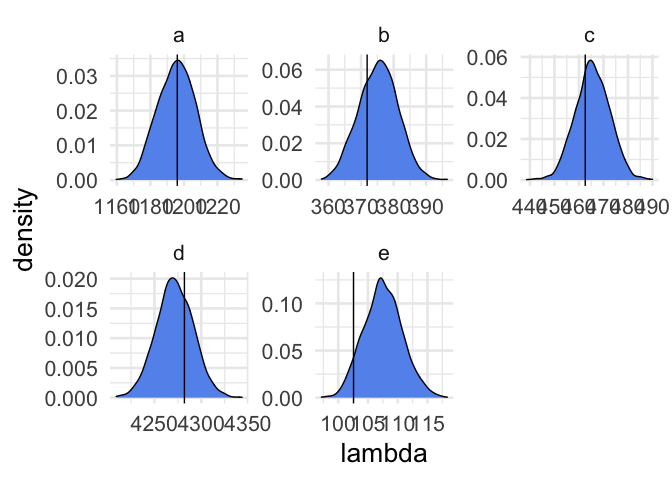

Competitive Leslie-Gower in discrete time
================
W.K. Petry
2021-Feb-15

## The model

<table>
<colgroup>
<col style="width: 31%" />
<col style="width: 68%" />
</colgroup>
<tbody>
<tr class="odd">
<td><strong>Number of species</strong></td>
<td><blockquote>
<p>=1</p>
</blockquote></td>
</tr>
<tr class="even">
<td><strong>Time</strong></td>
<td>discrete</td>
</tr>
<tr class="odd">
<td><strong>Interaction type(s)</strong></td>
<td>competition</td>
</tr>
<tr class="even">
<td><strong>Difference equation</strong></td>
<td><span class="math inline"><em>n</em><sub><em>i</em>, <em>t</em> + 1</sub> = (<em>λ</em><sub><em>i</em></sub><em>n</em><sub><em>i</em>, <em>t</em></sub>)/(1+∑<sub><em>i</em></sub><em>α</em><sub><em>i</em><em>j</em></sub><em>n</em><sub><em>j</em>, <em>t</em></sub>)</span></td>
</tr>
<tr class="odd">
<td><strong>Parameter meaning</strong></td>
<td><p><span class="math inline"><em>n</em><sub><em>i</em>, <em>t</em></sub></span>: number of individuals of species <span class="math inline"><em>i</em></span> at time <span class="math inline"><em>t</em></span></p>
<p><span class="math inline"><em>λ</em><sub><em>i</em></sub></span>: per-capita intrinsic rate of increase of species <span class="math inline"><em>i</em></span></p>
<p><span class="math inline"><em>α</em><sub><em>i</em><em>j</em></sub></span>: per-capita competitive effect of species <span class="math inline"><em>j</em></span> on species <span class="math inline"><em>i</em></span></p></td>
</tr>
<tr class="even">
<td><strong>Equilibrium</strong></td>
<td><span class="math inline"><em>n</em><sup>*</sup> = 0</span></td>
</tr>
<tr class="odd">
<td><strong>Original publication</strong></td>
<td><span class="citation" data-cites="leslie1958biometrika">Leslie and Gower (1958)</span></td>
</tr>
</tbody>
</table>

## Bayesian hierarchical model structure

THe Leslie-Gower model is a multi-species generalization of the
Beverton-Holt model.

This framing of the model imagines that you have individual-level data
on focal individuals. that includes the number and identity of
neighboring competitors (*n*<sub>*j*, *t*</sub>) and the number of
offspring produced by the focal individual
(*n*<sub>*i*, *t*</sub><sup>*o**f**f*</sup>). The observation of the
latent individual fecundities (*f*<sub>*t*</sub>) is a Poisson process.
Domain expertise is used to set the priors on *λ* and *α*.

$$
\\begin{aligned}
e &= mc^2 \\\\
c &\\sim \\mathrm{Normal}\\left(299792458, \\sigma\\right) \\\\
\\end{aligned}
$$

(If this equation looks jumbled, you may need to download the source
.Rmd or use a [browser
add-on](https://chrome.google.com/webstore/detail/mathjax-plugin-for-github/ioemnmodlmafdkllaclgeombjnmnbima)
to render it.)

## Stan code

``` r
## prepare Rmarkdown to input model
library(cmdstanr)  # remotes::install_github("stan-dev/cmdstanr")
register_knitr_engine()
```

``` stan
// Competitive n-species Leslie-Gower in discrete time
// W.K. Petry

// define the structure & types of data to which the model is fit
data {
  int<lower=0> N;                 // number of focal individuals (data rows)
  int<lower=0> nsp;               // number of species
  int<lower=0> focalsp[N];        // species index of the focal individual
  int<lower=0> offspring[N];      // observed offspring production by focal individual
  matrix[N,nsp] bkgd_dens;        // local densities by species (cols) around focal individuals (rows)
  // accept priors from user
  vector[nsp] lambda_mean;        // prior means for lambda
  vector[nsp] lambda_sd;          // prior standard deviations for lambda
  vector[nsp] es_mean;            // prior mean for competitive EFFECTS
  vector[nsp] es_sd;              // prior standard deviation for competitive EFFECTS
  vector[nsp] rs_mean;            // prior mean for competitive RESPONSES
  vector[nsp] rs_sd;              // prior standard deviation for competitive RESPONSES
}

// define the parameters to be fit
parameters {
  vector<lower=0>[nsp] lambda;   // per-capita intrinsic rate of increase
  vector<lower=0>[nsp] es;       // competitive EFFECTS of each species
  vector<lower=0>[nsp] rs;       // competitive RESPONSES of each species
}

transformed parameters {
  matrix[nsp,nsp] alpha = rs * es';  // interaction matrix
  vector<lower=0>[N] fec;        // expected fecundities
  for(i in 1:N) {
    fec[i] = lambda[focalsp[i]] / (1. + bkgd_dens[i] * alpha[focalsp[i]]');
  }
}

model {
  offspring ~ poisson(fec);      // observe expected fecundity
  lambda ~ normal(lambda_mean, lambda_sd);  // normal prior on lambda
  es ~ normal(es_mean, es_sd);   // normal prior on competitive EFFECTS
  rs ~ normal(rs_mean, rs_sd);   // normal prior on competitive RESPONSES
}
```

## Example data & fitting

``` r
library(posterior)
library(tidyverse)

# helper function to generate random integer combinations of competitors
rand_vect <- function(N, M, sd = 1, pos.only = TRUE) {
  vec <- rnorm(N, M/N, sd)
  if (abs(sum(vec)) < 0.01) vec <- vec + 1
  vec <- round(vec / sum(vec) * M)
  deviation <- M - sum(vec)
  for (. in seq_len(abs(deviation))) {
    vec[i] <- vec[i <- sample(N, 1)] + sign(deviation)
  }
  if (pos.only) while (any(vec < 0)) {
    negs <- vec < 0
    pos  <- vec > 0
    vec[negs][i] <- vec[negs][i <- sample(sum(negs), 1)] + 1
    vec[pos][i]  <- vec[pos ][i <- sample(sum(pos ), 1)] - 1
  }
  as.integer(vec)
}

## Experimental design
nsp <- 5L  # number of species
bkgd_total <- c(0L, 5L, 50L, 100L, 200L)
reps <- 10L

## Set parameters
set.seed(230342)
lambdas <- rlnorm(n = nsp, meanlog = 7, sdlog = 2) %>%
  `names<-`(letters[1:5])

rs <- rnorm(n = nsp, mean = 1.5, sd = 0.8)  # species per-capita RESPONSES to competitors
es <- rnorm(n = nsp, mean = 1.5, sd = 0.8)  # species per-capita EFFECTS on competitors
alphas <- (rs %o% es) + rnorm(n = nsp^2, mean = 0, sd = 0.25)  # species interaction coefficients
rownames(alphas) <- letters[1:nsp]
colnames(alphas) <- letters[1:nsp]

## Generate data
dat_df <- crossing(sp_focal = letters[1:nsp], bkgd_total, rep = 1:10) %>%
  mutate(bkgd_dens = map(.x = bkgd_total,
                         .f = ~`colnames<-`(t(matrix(rand_vect(nsp, M = .x, sd = .x))),
                                                      paste0("bkgd_", letters[1:nsp]))),
         offspring = map2_int(.x = sp_focal, .y = bkgd_dens,
                              .f = ~rpois(n = 1, as.numeric(lambdas[[.x]] / (1 + alphas[.x, ] %*% t(.y))))),
         bkgd_dens = map(.x = bkgd_dens, .f = data.frame)) %>%  ## help unnest capture column names
  unnest(bkgd_dens)

# prepare data for Stan
dat <- list(N = nrow(dat_df),
            nsp = nsp,
            focalsp = as.integer(factor(dat_df$sp_focal)),
            offspring = dat_df$offspring,
            bkgd_dens = as.matrix(select(dat_df, paste0("bkgd_", letters[1:nsp]))),
            # add priors
            lambda_mean = rep(1000, nsp),
            lambda_sd = rep(200, nsp),
            es_mean = rep(1.5, nsp),
            es_sd = rep(0.8, nsp),
            rs_mean = rep(1.5, nsp),
            rs_sd = rep(0.8, nsp))

## compile the model from an external .stan file
mod <- cmdstan_model("compet_disc_leslie-gower.stan")

## fit the model (sample the posterior)
ps <- mod$sample(data = dat, refresh = 500, chains = 2L, cores = 2L)
```

    ## Running MCMC with 2 parallel chains...
    ## 
    ## Chain 1 Iteration:    1 / 2000 [  0%]  (Warmup) 
    ## Chain 2 Iteration:    1 / 2000 [  0%]  (Warmup) 
    ## Chain 2 Iteration:  500 / 2000 [ 25%]  (Warmup) 
    ## Chain 1 Iteration:  500 / 2000 [ 25%]  (Warmup) 
    ## Chain 1 Iteration: 1000 / 2000 [ 50%]  (Warmup) 
    ## Chain 1 Iteration: 1001 / 2000 [ 50%]  (Sampling) 
    ## Chain 2 Iteration: 1000 / 2000 [ 50%]  (Warmup) 
    ## Chain 2 Iteration: 1001 / 2000 [ 50%]  (Sampling) 
    ## Chain 1 Iteration: 1500 / 2000 [ 75%]  (Sampling) 
    ## Chain 2 Iteration: 1500 / 2000 [ 75%]  (Sampling) 
    ## Chain 1 Iteration: 2000 / 2000 [100%]  (Sampling) 
    ## Chain 1 finished in 5.3 seconds.
    ## Chain 2 Iteration: 2000 / 2000 [100%]  (Sampling) 
    ## Chain 2 finished in 5.6 seconds.
    ## 
    ## Both chains finished successfully.
    ## Mean chain execution time: 5.5 seconds.
    ## Total execution time: 5.8 seconds.

``` r
pdat <- as_draws_df(ps$draws(variables = c("alpha", "lambda"))) %>%
  as_tibble()

palphamat <- as_draws_df(ps$draws(variables = c("alpha"))) %>%
  as_tibble() %>%
  pivot_longer(starts_with("alpha"), names_to = c("focal", "bkgd"),
               names_pattern = "^alpha\\[([0-9]+),([0-9]+)\\]", values_to = "alpha",
               names_transform = list(focal = as.integer, bkgd = as.integer)) %>%
  mutate(focal = letters[focal],
         bkgd = letters[bkgd])

plambda <- as_draws_df(ps$draws(variables = c("lambda"))) %>%
  as_tibble() %>%
  pivot_longer(starts_with("lambda"), names_to = "species", names_pattern = "^lambda\\[([0-9]+)\\]",
               values_to = "lambda", names_transform = list(species = as.integer)) %>%
  mutate(species = letters[species])

## examine posterior distribution vs. true values
# c(lambda = lambda, alpha = alpha)  # true values
summarize_draws(ps$draws(variables = c("lambda", "alpha")))  # posterior summary
```

    ## # A tibble: 30 x 10
    ##    variable    mean  median      sd     mad      q5     q95  rhat ess_bulk
    ##    <chr>      <dbl>   <dbl>   <dbl>   <dbl>   <dbl>   <dbl> <dbl>    <dbl>
    ##  1 lambda[… 1.20e+3 1.20e+3 11.2    11.5    1.18e+3 1.21e+3 1.00     2346.
    ##  2 lambda[… 3.75e+2 3.75e+2  5.96    6.10   3.65e+2 3.85e+2 0.999    1836.
    ##  3 lambda[… 4.66e+2 4.65e+2  7.02    6.93   4.54e+2 4.77e+2 1.00     1715.
    ##  4 lambda[… 4.27e+3 4.27e+3 19.7    19.7    4.24e+3 4.30e+3 1.00     2073.
    ##  5 lambda[… 1.08e+2 1.07e+2  3.22    3.25   1.02e+2 1.13e+2 1.00     1902.
    ##  6 alpha[1… 8.48e-1 8.49e-1  0.0336  0.0334 7.93e-1 9.04e-1 1.00     1991.
    ##  7 alpha[2… 1.19e+0 1.18e+0  0.0718  0.0749 1.08e+0 1.31e+0 1.00     2165.
    ##  8 alpha[3… 1.33e+0 1.32e+0  0.0733  0.0724 1.21e+0 1.45e+0 1.00     2265.
    ##  9 alpha[4… 9.27e-1 9.26e-1  0.0214  0.0218 8.92e-1 9.62e-1 1.00     1959.
    ## 10 alpha[5… 2.00e+0 1.99e+0  0.225   0.220  1.66e+0 2.41e+0 1.00     2419.
    ## # … with 20 more rows, and 1 more variable: ess_tail <dbl>

``` r
# 
ggplot(palphamat, aes(x = alpha))+
  geom_density(fill = "cornflowerblue")+
  geom_vline(data = rownames_to_column(as.data.frame(alphas), "focal") %>%
               pivot_longer(-focal, names_to = "bkgd", values_to = "alpha"),
             aes(xintercept = alpha))+
  facet_grid(focal~bkgd, scales = "free_y")+
  theme_minimal(base_size = 20)
```

<!-- -->

``` r
ggplot(plambda, aes(x = lambda))+
  geom_density(fill = "cornflowerblue")+
  geom_vline(data = rownames_to_column(as.data.frame(lambdas), "species"),
             aes(xintercept = lambdas))+
  facet_wrap(~species, scale = "free")+
  theme_minimal(base_size = 20)
```

<!-- -->

``` r
## Determine pairwise probabilities of competitive outcomes
```

## Variations

-   Change the observation process to allow for over-dispersion

## Session info

``` r
sessionInfo()
```

    ## R version 4.0.3 (2020-10-10)
    ## Platform: x86_64-apple-darwin17.0 (64-bit)
    ## Running under: macOS Mojave 10.14.6
    ## 
    ## Matrix products: default
    ## BLAS:   /Library/Frameworks/R.framework/Versions/4.0/Resources/lib/libRblas.dylib
    ## LAPACK: /Library/Frameworks/R.framework/Versions/4.0/Resources/lib/libRlapack.dylib
    ## 
    ## locale:
    ## [1] en_US.UTF-8/en_US.UTF-8/en_US.UTF-8/C/en_US.UTF-8/en_US.UTF-8
    ## 
    ## attached base packages:
    ## [1] stats     graphics  grDevices utils     datasets  methods   base     
    ## 
    ## other attached packages:
    ##  [1] forcats_0.5.1       stringr_1.4.0       dplyr_1.0.4        
    ##  [4] purrr_0.3.4         readr_1.4.0         tidyr_1.1.2        
    ##  [7] tibble_3.0.6        ggplot2_3.3.3       tidyverse_1.3.0    
    ## [10] posterior_0.1.3     cmdstanr_0.3.0.9000
    ## 
    ## loaded via a namespace (and not attached):
    ##  [1] tidyselect_1.1.0  xfun_0.21         haven_2.3.1       colorspace_2.0-0 
    ##  [5] vctrs_0.3.6       generics_0.1.0    htmltools_0.5.1.1 yaml_2.2.1       
    ##  [9] utf8_1.1.4        rlang_0.4.10      pillar_1.4.7      glue_1.4.2       
    ## [13] withr_2.4.1       DBI_1.1.1         dbplyr_2.1.0      modelr_0.1.8     
    ## [17] readxl_1.3.1      lifecycle_0.2.0   munsell_0.5.0     gtable_0.3.0     
    ## [21] cellranger_1.1.0  rvest_0.3.6       evaluate_0.14     labeling_0.4.2   
    ## [25] knitr_1.31        ps_1.5.0          fansi_0.4.2       highr_0.8        
    ## [29] broom_0.7.4       Rcpp_1.0.6        backports_1.2.1   scales_1.1.1     
    ## [33] checkmate_2.0.0   jsonlite_1.7.2    abind_1.4-5       farver_2.0.3     
    ## [37] fs_1.5.0          hms_1.0.0         digest_0.6.27     stringi_1.5.3    
    ## [41] processx_3.4.5    grid_4.0.3        cli_2.3.0         tools_4.0.3      
    ## [45] magrittr_2.0.1    crayon_1.4.1      pkgconfig_2.0.3   ellipsis_0.3.1   
    ## [49] data.table_1.13.6 xml2_1.3.2        reprex_1.0.0      lubridate_1.7.9.2
    ## [53] assertthat_0.2.1  rmarkdown_2.6     httr_1.4.2        rstudioapi_0.13  
    ## [57] R6_2.5.0          compiler_4.0.3

## References

<div id="refs" class="references csl-bib-body hanging-indent">

<div id="ref-cushing2004jdiffeqappl" class="csl-entry">

Cushing, J.M., S. Leverge, N. Chitnis, and S.M. Henson. 2004. “Some
Discrete Competition Models and the Competitive Exclusion Principle.” *J
Diff Eq Appl* 10.

</div>

<div id="ref-leslie1958biometrika" class="csl-entry">

Leslie, P.H., and J.C. Gower. 1958. “The Properties of a Stochastic
Model for Two Competing Species.” *Biometrika* 45.

</div>

</div>
