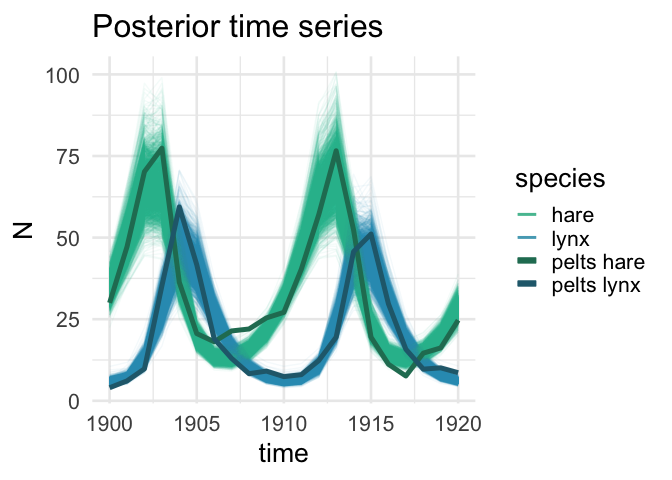
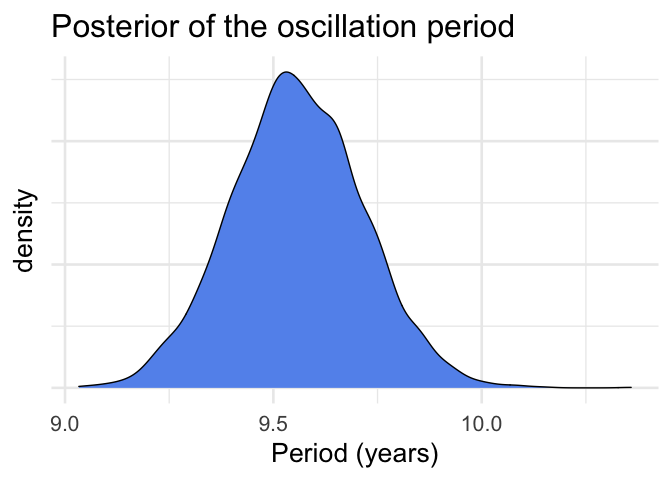

Consumer-resource Lotka-Volterra in continuous time
================
W.K. Petry
2021-Feb-13

## The model

<table>
<colgroup>
<col style="width: 31%" />
<col style="width: 68%" />
</colgroup>
<tbody>
<tr class="odd">
<td><strong>Number of species</strong></td>
<td>2</td>
</tr>
<tr class="even">
<td><strong>Time</strong></td>
<td>continuous</td>
</tr>
<tr class="odd">
<td><strong>Interaction type(s)</strong></td>
<td>consumer-resource</td>
</tr>
<tr class="even">
<td><strong>Differential equations</strong></td>
<td><div class="line-block"><span class="math inline">$\frac{du}{dt}=\alpha u-\beta uv$</span></div>
<span class="math inline">$\frac{dv}{dt}=-\gamma v+\delta uv$</span></td>
</tr>
<tr class="odd">
<td><strong>Parameter meaning</strong></td>
<td><p><span class="math inline"><em>u</em></span>: number of resource/prey</p>
<p><span class="math inline"><em>v</em></span>: number of consumers/prey</p>
<p><span class="math inline"><em>α</em></span>: resource/prey growth rate</p>
<p><span class="math inline"><em>β</em></span>: resource loss/predation rate</p>
<p><span class="math inline"><em>δ</em></span>: resource/prey conversion rate to consumer growth</p>
<p><span class="math inline"><em>γ</em></span>: consumer/predator mortality rate</p></td>
</tr>
<tr class="even">
<td><strong>Equilibrium</strong></td>
<td><p><span class="math inline"><em>v</em> = <em>α</em>/<em>β</em></span></p>
<p><span class="math inline"><em>u</em> = <em>γ</em>/<em>δ</em></span></p></td>
</tr>
<tr class="odd">
<td><strong>Original publications</strong></td>
<td><div class="line-block"><span class="citation" data-cites="lotka1925">Lotka (1925)</span> and <span class="citation" data-cites="volterra1926">Volterra (1926)</span></div></td>
</tr>
</tbody>
</table>

## Bayesian hierarchical model structure

Carpenter (2018) provides a thorough introduction to the model and its
fit with Stan. Here we simply summarize the key features for
completeness, deferring to the original for full detail.

The model assumes that the latent state of the system is the vector
**z** = (*u*, *v*), describing the ‘true’ abundances of the consumer and
resource. The latent state is observed through simultaneous counts the
organisms, **y**, at a particular time.

$$
\\begin{aligned}
y\_{n,k} &\\sim \\mathrm{LogNormal}\\left(\\mathrm{log}(z\_{n,k}), \\sigma\_n\\right) \\\\
\\mathbf{z}\_n = \\left\[\\begin{matrix}u(t\_n)\\\\v(t\_n)\\end{matrix}\\right\] &= \\left\\{\\begin{matrix}\\alpha u-\\beta uv \\\\ -\\gamma v+\\delta uv\\end{matrix}\\right\\} \\\\
y\_{\\mathrm{init},k} &\\sim \\mathrm{LogNormal}\\left(\\mathrm{log}(z\_{\\mathrm{init},k}), \\sigma\_n\\right) \\\\
z\_{\\mathrm{init, k}} &\\sim \\mathrm{LogNormal}\\left(\\mathrm{log}(\\mu\_{\\mathrm{init}}), \\sigma\_{\\mathrm{init}}\\right) \\\\
\\alpha, \\gamma &\\sim \\mathrm{Normal}\\left(\\mu\_1, \\sigma\_1\\right) \\\\
\\beta, \\delta &\\sim \\mathrm{Normal}\\left(\\mu\_2, \\sigma\_2\\right) \\\\
\\sigma\_n &\\sim \\mathrm{LogNormal}\\left(\\mu\_{\\mathrm{noise}}, \\sigma\_{\\mathrm{noise}}\\right)
\\end{aligned}
$$

(If this equation looks jumbled, you may need to download the source
.Rmd or use a [browser
add-on](https://chrome.google.com/webstore/detail/mathjax-plugin-for-github/ioemnmodlmafdkllaclgeombjnmnbima)
to render it.)

## Stan code

``` r
## prepare Rmarkdown to input model
library(cmdstanr)  # remotes::install_github("stan-dev/cmdstanr")
register_knitr_engine()
```

``` stan
// Consumer-resource Lotka-Volterra in continuous time
// © 2017–2018, Trustees of Columbia University in New York, licensed under BSD-3.
// originally published: https://mc-stan.org/users/documentation/case-studies/lotka-volterra-predator-prey.html

functions {
  real[] dz_dt(real t,       // time
               real[] z,     // system state {prey, predator}
               real[] theta, // parameters
               real[] x_r,   // unused data
               int[] x_i) {
    real u = z[1];
    real v = z[2];

    real alpha = theta[1];
    real beta = theta[2];
    real gamma = theta[3];
    real delta = theta[4];

    real du_dt = (alpha - beta * v) * u;
    real dv_dt = (-gamma + delta * u) * v;

    return { du_dt, dv_dt };
  }
}
data {
  int<lower = 0> N;          // number of measurement times
  real ts[N];                // measurement times > 0
  real y_init[2];            // initial measured populations
  real<lower = 0> y[N, 2];   // measured populations
}
parameters {
  real<lower = 0> theta[4];   // { alpha, beta, gamma, delta }
  real<lower = 0> z_init[2];  // initial population
  real<lower = 0> sigma[2];   // measurement errors
}
transformed parameters {
  real z[N, 2]
  = integrate_ode_rk45(dz_dt, z_init, 0, ts, theta,
  rep_array(0.0, 0), rep_array(0, 0),
  1e-5, 1e-3, 5e2);
}
model {
  theta[{1, 3}] ~ normal(1, 0.5);
  theta[{2, 4}] ~ normal(0.05, 0.05);
  sigma ~ lognormal(-1, 1);
  z_init ~ lognormal(log(10), 1);
  for (k in 1:2) {
    y_init[k] ~ lognormal(log(z_init[k]), sigma[k]);
    y[ , k] ~ lognormal(log(z[, k]), sigma[k]);
  }
}
generated quantities {
  real y_init_rep[2];
  real y_rep[N, 2];
  for (k in 1:2) {
    y_init_rep[k] = lognormal_rng(log(z_init[k]), sigma[k]);
    for (n in 1:N)
      y_rep[n, k] = lognormal_rng(log(z[n, k]), sigma[k]);
  }
}
```

## Example data & fitting

We will fit the model to real-world data of lynx and hare pelts trapped
by the Hudson’s Bay Company between 1900-1920 (*note: these data have
gone through a series of telephone game-like cycles of being extracted
from figures. Caveat emptor.*) The code below has been modified from
Carpenter (2018).

``` r
library(posterior)
library(ggplot2)
library(dplyr)
library(tidyr)
library(GGally)

## read in data
lynx_hare_df <- read.csv("https://raw.githubusercontent.com/stan-dev/example-models/master/knitr/lotka-volterra/hudson-bay-lynx-hare.csv",
                         comment.char="#")

## prepare data for Stan
N <- length(lynx_hare_df$Year) - 1
ts <- 1:N
y_init <- c(lynx_hare_df$Hare[1], lynx_hare_df$Lynx[1])
y <- as.matrix(lynx_hare_df[2:(N + 1), 2:3])
y <- cbind(y[ , 2], y[ , 1]); # hare, lynx order
dat <- list(N = N, ts = ts, y_init = y_init, y = y)

## compile the model from an external .stan file
mod <- cmdstan_model("conres_cont_lotka-volterra.stan")

## fit the model (sample the posterior)
ps <- mod$sample(data = dat, refresh = 500, seed = 23003)
```

    ## Running MCMC with 4 sequential chains...
    ## 
    ## Chain 1 Iteration:    1 / 2000 [  0%]  (Warmup) 
    ## Chain 1 Iteration:  500 / 2000 [ 25%]  (Warmup) 
    ## Chain 1 Iteration: 1000 / 2000 [ 50%]  (Warmup) 
    ## Chain 1 Iteration: 1001 / 2000 [ 50%]  (Sampling) 
    ## Chain 1 Iteration: 1500 / 2000 [ 75%]  (Sampling) 
    ## Chain 1 Iteration: 2000 / 2000 [100%]  (Sampling) 
    ## Chain 1 finished in 24.7 seconds.
    ## Chain 2 Iteration:    1 / 2000 [  0%]  (Warmup) 
    ## Chain 2 Iteration:  500 / 2000 [ 25%]  (Warmup) 
    ## Chain 2 Iteration: 1000 / 2000 [ 50%]  (Warmup) 
    ## Chain 2 Iteration: 1001 / 2000 [ 50%]  (Sampling) 
    ## Chain 2 Iteration: 1500 / 2000 [ 75%]  (Sampling) 
    ## Chain 2 Iteration: 2000 / 2000 [100%]  (Sampling) 
    ## Chain 2 finished in 28.6 seconds.
    ## Chain 3 Iteration:    1 / 2000 [  0%]  (Warmup) 
    ## Chain 3 Iteration:  500 / 2000 [ 25%]  (Warmup) 
    ## Chain 3 Iteration: 1000 / 2000 [ 50%]  (Warmup) 
    ## Chain 3 Iteration: 1001 / 2000 [ 50%]  (Sampling) 
    ## Chain 3 Iteration: 1500 / 2000 [ 75%]  (Sampling) 
    ## Chain 3 Iteration: 2000 / 2000 [100%]  (Sampling) 
    ## Chain 3 finished in 18.9 seconds.
    ## Chain 4 Iteration:    1 / 2000 [  0%]  (Warmup) 
    ## Chain 4 Iteration:  500 / 2000 [ 25%]  (Warmup) 
    ## Chain 4 Iteration: 1000 / 2000 [ 50%]  (Warmup) 
    ## Chain 4 Iteration: 1001 / 2000 [ 50%]  (Sampling) 
    ## Chain 4 Iteration: 1500 / 2000 [ 75%]  (Sampling) 
    ## Chain 4 Iteration: 2000 / 2000 [100%]  (Sampling) 
    ## Chain 4 finished in 17.2 seconds.
    ## 
    ## All 4 chains finished successfully.
    ## Mean chain execution time: 22.3 seconds.
    ## Total execution time: 89.9 seconds.

``` r
pdraws <- rename_variables(ps$draws(), alpha = "theta[1]", beta = "theta[2]", gamma = "theta[3]",
                         delta = "theta[4]", `z[0,1]` = "z_init[1]", `z[0,2]` = "z_init[2]")
pdat <- as_draws_df(pdraws)

pts <- pdat %>%
  as_tibble() %>%
  select(.draw, starts_with("z[")) %>%
  pivot_longer(cols = -.draw, names_to = c("time", "species"),
               names_pattern = "z\\[([0-9]+),([1-2])\\]", values_to = "latent_N",
               names_transform = list(time = as.integer)) %>%
  mutate(time = 1900 + time,
         species = case_when(
           species == "1" ~ "hare",
           species == "2" ~ "lynx"
         ))

## examine pairwise views of posterior distribution
summarize_draws(pdraws)  # posterior summary
```

    ## # A tibble: 91 x 10
    ##    variable     mean   median      sd     mad       q5      q95  rhat ess_bulk
    ##    <chr>       <dbl>    <dbl>   <dbl>   <dbl>    <dbl>    <dbl> <dbl>    <dbl>
    ##  1 lp__     -14.0    -13.6    2.17    2.03    -18.2    -11.2     1.00    1350.
    ##  2 alpha      0.546    0.541  0.0659  0.0636    0.444    0.659   1.00     887.
    ##  3 beta       0.0276   0.0273 0.00433 0.00415   0.0211   0.0352  1.00     968.
    ##  4 gamma      0.803    0.799  0.0939  0.0897    0.663    0.965   1.00     864.
    ##  5 delta      0.0242   0.0239 0.00372 0.00356   0.0187   0.0306  1.00     893.
    ##  6 z[0,1]    34.0     33.9    2.99    3.01     29.3     39.1     1.00    2676.
    ##  7 z[0,2]     5.94     5.92   0.551   0.509     5.08     6.86    1.00    1773.
    ##  8 sigma[1]   0.248    0.242  0.0424  0.0394    0.189    0.324   1.00    3256.
    ##  9 sigma[2]   0.253    0.246  0.0439  0.0401    0.195    0.335   1.00    2372.
    ## 10 z[1,1]    49.3     49.0    4.63    4.64     42.2     57.2     1.00    1919.
    ## # … with 81 more rows, and 1 more variable: ess_tail <dbl>

``` r
## examine the posterior latent timeseries (+ observed pelt counts)
ggplot(pts, aes(x = time, y = latent_N, group = paste0(.draw, species), color = species))+
  geom_line(alpha = 0.05)+
  geom_line(data = lynx_hare_df, aes(x = Year, y = Hare, color = "pelts hare"), inherit.aes = FALSE,
            size = 1.75)+
  geom_line(data = lynx_hare_df, aes(x = Year, y = Lynx, color = "pelts lynx"), inherit.aes = FALSE,
            size = 1.75)+
  labs(title = "Posterior time series", y = "N")+
  scale_color_manual(values = c("#37b792", "#379cb7", "#257b62", "#25697b"),
                     guide = guide_legend(override.aes = list(size = c(1, 1, 2, 2),
                                                              alpha = c(0.5, 0.5, 1, 1))))+
  theme_minimal(base_size = 20)
```

<!-- -->

``` r
## determine the period of the oscillations around the fixed point
period <- (2 * pi) / sqrt(pdat$alpha * pdat$gamma)

ggplot(data = NULL, aes(x = period))+
  geom_density(fill = "cornflowerblue")+
  labs(title = "Posterior of the oscillation period", x = "Period (years)")+
  theme_minimal(base_size = 20)+
  theme(axis.text.y = element_blank())
```

<!-- -->

## Variations

-   Add a lag variable, following McElreath (2020) (p. 551)
-   Add observation (trap) probability parameter to prevent the latent
    number from being less than the observed number of pelts, following
    McElreath (2020) (p. 545-550)

## Session info

``` r
sessionInfo()
```

    ## R version 4.0.3 (2020-10-10)
    ## Platform: x86_64-apple-darwin17.0 (64-bit)
    ## Running under: macOS Mojave 10.14.6
    ## 
    ## Matrix products: default
    ## BLAS:   /Library/Frameworks/R.framework/Versions/4.0/Resources/lib/libRblas.dylib
    ## LAPACK: /Library/Frameworks/R.framework/Versions/4.0/Resources/lib/libRlapack.dylib
    ## 
    ## locale:
    ## [1] en_US.UTF-8/en_US.UTF-8/en_US.UTF-8/C/en_US.UTF-8/en_US.UTF-8
    ## 
    ## attached base packages:
    ## [1] stats     graphics  grDevices utils     datasets  methods   base     
    ## 
    ## other attached packages:
    ## [1] GGally_2.1.0        tidyr_1.1.2         dplyr_1.0.4        
    ## [4] ggplot2_3.3.3       posterior_0.1.3     cmdstanr_0.3.0.9000
    ## 
    ## loaded via a namespace (and not attached):
    ##  [1] Rcpp_1.0.6         highr_0.8          plyr_1.8.6         RColorBrewer_1.1-2
    ##  [5] compiler_4.0.3     pillar_1.4.7       tools_4.0.3        digest_0.6.27     
    ##  [9] jsonlite_1.7.2     evaluate_0.14      lifecycle_0.2.0    tibble_3.0.6      
    ## [13] gtable_0.3.0       checkmate_2.0.0    pkgconfig_2.0.3    rlang_0.4.10      
    ## [17] cli_2.3.0          DBI_1.1.1          yaml_2.2.1         xfun_0.21         
    ## [21] withr_2.4.1        stringr_1.4.0      knitr_1.31         generics_0.1.0    
    ## [25] vctrs_0.3.6        grid_4.0.3         tidyselect_1.1.0   data.table_1.13.6 
    ## [29] reshape_0.8.8      glue_1.4.2         R6_2.5.0           processx_3.4.5    
    ## [33] fansi_0.4.2        rmarkdown_2.6      farver_2.0.3       purrr_0.3.4       
    ## [37] magrittr_2.0.1     backports_1.2.1    scales_1.1.1       ps_1.5.0          
    ## [41] htmltools_0.5.1.1  ellipsis_0.3.1     assertthat_0.2.1   abind_1.4-5       
    ## [45] colorspace_2.0-0   labeling_0.4.2     utf8_1.1.4         stringi_1.5.3     
    ## [49] munsell_0.5.0      crayon_1.4.1

## References

<div id="refs" class="references csl-bib-body hanging-indent">

<div id="ref-carpenter2018" class="csl-entry">

Carpenter, Bob. 2018. “Predator-Prey Population Dynamics: The
Lotka-Volterra Model in Stan.” 2018.
<https://mc-stan.org/users/documentation/case-studies/lotka-volterra-predator-prey.html>.

</div>

<div id="ref-lotka1925" class="csl-entry">

Lotka, A.J. 1925. *Principles of Physical Biology*. Waverly.

</div>

<div id="ref-mcelreath2020" class="csl-entry">

McElreath, Richard. 2020. *Statistical Rethinking*. 2nd ed. CRC Press.

</div>

<div id="ref-volterra1926" class="csl-entry">

Volterra, Vito. 1926. “Variazioni e Fluttuazioni Del Numero d’individui
in Specie Animali Conviventi.” *Memorie Della R. Accademia Dei Lincei,
6th Ser.* 2.

</div>

</div>
