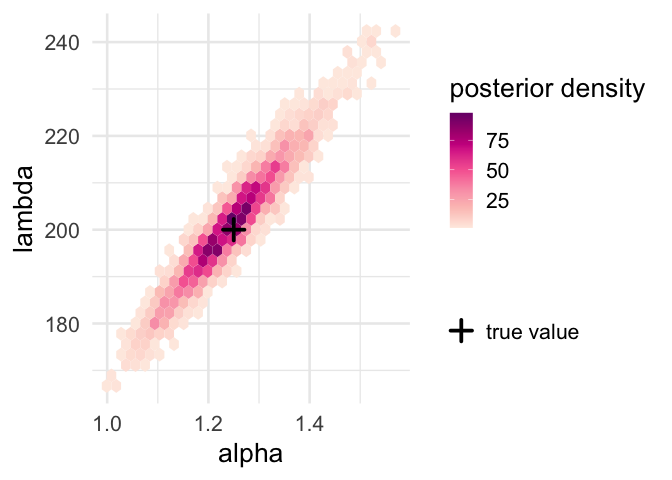

Competitive Beverton-Holt
================
W.K. Petry
2021-Feb-12

## The model

<table>
<colgroup>
<col style="width: 31%" />
<col style="width: 68%" />
</colgroup>
<tbody>
<tr class="odd">
<td><strong>Number of species</strong></td>
<td>1</td>
</tr>
<tr class="even">
<td><strong>Time</strong></td>
<td>discrete</td>
</tr>
<tr class="odd">
<td><strong>Interaction type(s)</strong></td>
<td>competition</td>
</tr>
<tr class="even">
<td><strong>Difference equation</strong></td>
<td><span class="math inline"><em>n</em><sub><em>t</em> + 1</sub> = <em>n</em><sub><em>t</em></sub><em>λ</em>/(1 + <em>α</em><em>n</em><sub><em>t</em></sub>)</span></td>
</tr>
<tr class="odd">
<td><strong>Parameter meaning</strong></td>
<td><p><span class="math inline"><em>n</em><sub><em>t</em></sub></span>: number of individuals at time <span class="math inline"><em>t</em></span></p>
<p><span class="math inline"><em>λ</em></span>: per-capita intrinsic rate of increase</p>
<p><span class="math inline"><em>α</em></span>: (intra-specific) competition coefficient</p></td>
</tr>
<tr class="even">
<td><strong>Equilibrium</strong></td>
<td><span class="math inline"><em>n</em><sup>*</sup> = (<em>λ</em> − 1)/<em>α</em></span></td>
</tr>
<tr class="odd">
<td><strong>Original publication</strong></td>
<td><span class="citation" data-cites="beverton1957">Beverton and Holt (1957)</span>, using carrying capacity parameterization</td>
</tr>
</tbody>
</table>

## Bayesian hierarchical model structure

This framing of the model imagines that you have individual-level data
on focal individuals. that includes the number of neighboring
competitors (*n*<sub>*t*</sub>) and the number of offspring produced
(*n*<sub>*o**f**f*, *t*</sub>). The observation of the latent individual
fecundities (*f*<sub>*t*</sub>) is a Poisson process. Domain expertise
is used to set the priors on *λ* and *α*.

$$
\\begin{aligned}
n\_{\\mathrm{off}, t} &\\sim \\mathrm{Poisson}\\left(f\_{t}\\right) \\\\
f\_t &= \\frac{\\lambda}{1+\\alpha n\_{t}} \\\\
\\lambda &\\sim \\mathrm{Normal}\\left(\\mu\_{\\lambda},\\sigma\_{\\lambda}\\right) \\\\
\\alpha &\\sim \\mathrm{Normal}\\left(\\mu\_{\\alpha},\\sigma\_{\\alpha}\\right).
\\end{aligned}
$$

## Stan code

``` r
## prepare Rmarkdown to input model
library(cmdstanr)  # remotes::install_github("stan-dev/cmdstanr")
register_knitr_engine()
```

``` stan
// Beverton-Holt competition model
// W.K. Petry

// define the structure & types of data to which the model is fit
data {
  int<lower=0> N;                 // number of focal individuals (data rows)
  int<lower=0> offspring[N];      // observed offspring production by focals
  int<lower=0> bkgd_dens[N];      // local densities around focal individuals
  // accept priors from user
  real<lower=0> lambda_mean;      // prior mean for lambda
  real<lower=0> lambda_sd;        // prior standard deviation for lambda
  real<lower=0> alpha_mean;       // prior mean for competition coefficient
  real<lower=0> alpha_sd;         // prior standard deviation for competition coefficent
}

// define the parameters to be fit
parameters {
  real<lower=0> lambda;          // per-capita intrinsic rate of increase
  real<lower=0> alpha;           // competition coefficient
}

transformed parameters {
  vector[N] fec;                 // turn data-generating process crank
  for (i in 1:N) {               // to get latent fecundity
    fec[i] = lambda / (1. + alpha * bkgd_dens[i]);
  }
}

model {
  offspring ~ poisson(fec);     // observe latent fecundity as whole offspring
  lambda ~ normal(lambda_mean, lambda_sd);  // normal prior on lambda
  alpha ~ normal(alpha_mean, alpha_sd);     // normal prior on alpha
}
```

## Example data & fitting

``` r
library(posterior)
library(ggplot2)

## set 'true' parameter values
lambda <- 200
alpha <- 1.25

## generate synthetic data
set.seed(58428)
N <- 500L  # number of observed individuals
bkgd_dens <- as.integer(round(runif(n = N, min = 0L, max = 100)))
offspring <- rpois(n = N, lambda = (lambda / (1 + alpha * bkgd_dens)))

dat <- list(N = N, bkgd_dens = bkgd_dens, offspring = offspring)

## add priors
## (note both parameters are truncated at zero by the Stan code)
dat$lambda_mean <- 100
dat$lambda_sd <- 50
dat$alpha_mean <- 0
dat$alpha_sd <- 1

## compile the model from an external .stan file
bh <- cmdstan_model("bh.stan")

## fit the model (sample the posterior)
ps <- bh$sample(data = dat, refresh = 500)
```

    ## Running MCMC with 4 sequential chains...
    ## 
    ## Chain 1 Iteration:    1 / 2000 [  0%]  (Warmup) 
    ## Chain 1 Iteration:  500 / 2000 [ 25%]  (Warmup) 
    ## Chain 1 Iteration: 1000 / 2000 [ 50%]  (Warmup) 
    ## Chain 1 Iteration: 1001 / 2000 [ 50%]  (Sampling) 
    ## Chain 1 Iteration: 1500 / 2000 [ 75%]  (Sampling) 
    ## Chain 1 Iteration: 2000 / 2000 [100%]  (Sampling) 
    ## Chain 1 finished in 2.5 seconds.
    ## Chain 2 Iteration:    1 / 2000 [  0%]  (Warmup) 
    ## Chain 2 Iteration:  500 / 2000 [ 25%]  (Warmup) 
    ## Chain 2 Iteration: 1000 / 2000 [ 50%]  (Warmup) 
    ## Chain 2 Iteration: 1001 / 2000 [ 50%]  (Sampling) 
    ## Chain 2 Iteration: 1500 / 2000 [ 75%]  (Sampling) 
    ## Chain 2 Iteration: 2000 / 2000 [100%]  (Sampling) 
    ## Chain 2 finished in 1.3 seconds.
    ## Chain 3 Iteration:    1 / 2000 [  0%]  (Warmup) 
    ## Chain 3 Iteration:  500 / 2000 [ 25%]  (Warmup) 
    ## Chain 3 Iteration: 1000 / 2000 [ 50%]  (Warmup) 
    ## Chain 3 Iteration: 1001 / 2000 [ 50%]  (Sampling) 
    ## Chain 3 Iteration: 1500 / 2000 [ 75%]  (Sampling) 
    ## Chain 3 Iteration: 2000 / 2000 [100%]  (Sampling) 
    ## Chain 3 finished in 1.0 seconds.
    ## Chain 4 Iteration:    1 / 2000 [  0%]  (Warmup) 
    ## Chain 4 Iteration:  500 / 2000 [ 25%]  (Warmup) 
    ## Chain 4 Iteration: 1000 / 2000 [ 50%]  (Warmup) 
    ## Chain 4 Iteration: 1001 / 2000 [ 50%]  (Sampling) 
    ## Chain 4 Iteration: 1500 / 2000 [ 75%]  (Sampling) 
    ## Chain 4 Iteration: 2000 / 2000 [100%]  (Sampling) 
    ## Chain 4 finished in 1.0 seconds.
    ## 
    ## All 4 chains finished successfully.
    ## Mean chain execution time: 1.4 seconds.
    ## Total execution time: 6.2 seconds.

``` r
pdat <- as_draws_df(ps$draws(variables = c("lambda", "alpha")))

## plot posterior
ggplot(data = NULL, aes(x = alpha, y = lambda))+
  geom_hex(data = pdat)+
  geom_point(aes(color = "true value"), shape = 3, stroke = 2, size = 4)+
  scale_color_manual(name = "", values = "black")+
  scale_fill_distiller(name = "posterior density", palette = "RdPu",
                       direction = 1)+
  theme_minimal(base_size = 20)
```

<!-- -->

## Variations

-   Change the observation process to allow for overdispersion (e.g.,
    negative binomial)

-   Set heavier-tailed prior on *α* (e.g., Student’s t)

-   Set more flexible prior on *λ* (e.g., log-normal)

## Session info

``` r
sessionInfo()
```

    ## R version 4.0.3 (2020-10-10)
    ## Platform: x86_64-apple-darwin17.0 (64-bit)
    ## Running under: macOS Mojave 10.14.6
    ## 
    ## Matrix products: default
    ## BLAS:   /Library/Frameworks/R.framework/Versions/4.0/Resources/lib/libRblas.dylib
    ## LAPACK: /Library/Frameworks/R.framework/Versions/4.0/Resources/lib/libRlapack.dylib
    ## 
    ## locale:
    ## [1] en_US.UTF-8/en_US.UTF-8/en_US.UTF-8/C/en_US.UTF-8/en_US.UTF-8
    ## 
    ## attached base packages:
    ## [1] stats     graphics  grDevices utils     datasets  methods   base     
    ## 
    ## other attached packages:
    ## [1] ggplot2_3.3.3       posterior_0.1.3     cmdstanr_0.3.0.9000
    ## 
    ## loaded via a namespace (and not attached):
    ##  [1] highr_0.8          RColorBrewer_1.1-2 compiler_4.0.3     pillar_1.4.7      
    ##  [5] tools_4.0.3        digest_0.6.27      lattice_0.20-41    jsonlite_1.7.2    
    ##  [9] evaluate_0.14      lifecycle_0.2.0    tibble_3.0.6       gtable_0.3.0      
    ## [13] checkmate_2.0.0    pkgconfig_2.0.3    rlang_0.4.10       DBI_1.1.1         
    ## [17] yaml_2.2.1         hexbin_1.28.2      xfun_0.21          withr_2.4.1       
    ## [21] stringr_1.4.0      dplyr_1.0.4        knitr_1.31         generics_0.1.0    
    ## [25] vctrs_0.3.6        grid_4.0.3         tidyselect_1.1.0   data.table_1.13.6 
    ## [29] glue_1.4.2         R6_2.5.0           processx_3.4.5     rmarkdown_2.6     
    ## [33] farver_2.0.3       purrr_0.3.4        magrittr_2.0.1     backports_1.2.1   
    ## [37] scales_1.1.1       ps_1.5.0           htmltools_0.5.1.1  ellipsis_0.3.1    
    ## [41] assertthat_0.2.1   abind_1.4-5        colorspace_2.0-0   labeling_0.4.2    
    ## [45] stringi_1.5.3      munsell_0.5.0      crayon_1.4.1

## References

<div id="refs" class="references csl-bib-body hanging-indent">

<div id="ref-beverton1957" class="csl-entry">

Beverton, R.J., and S.J. Holt. 1957. *On the Dynamics of Exploited Fish
Populations*. *Fishery Investigations Series II*. Vol. XIX. Ministry of
Agriculture, Fisheries and Food.

</div>

<div id="ref-cushing2004jdiffeqappl" class="csl-entry">

Cushing, J.M., S. Leverge, N. Chitnis, and S.M. Henson. 2004. “Some
Discrete Competition Models and the Competitive Exclusion Principle.” *J
Diff Eq Appl* 10.

</div>

</div>
